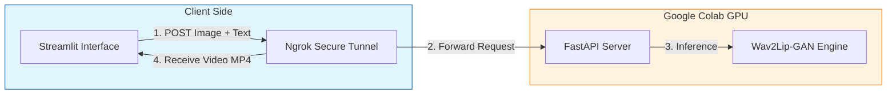

# Infinite Talk AI 🗣️🎥

[](https://www.python.org/)
[](https://streamlit.io/)
[-F9AB00?logo=googlecolab&logoColor=white>)](https://colab.research.google.com/)
[]()

> **A distributed Generative AI application that decouples the frontend from the heavy inference engine.**

**Developed by:** Lakshan | CEO, [Xpersive Labs](https://xpersivelabs.com)

---

## 📖 Overview

**Infinite Talk AI** is a "talking head" video generator that animates static portraits using text-to-speech audio.

To solve the challenge of running heavy Deep Learning models (Wav2Lip-GAN) on standard hardware, this project implements a **Distributed Headless Architecture**:

- **The Client (Local):** A lightweight Streamlit UI that runs on any laptop.
- **The Server (Cloud):** A FastAPI backend running on Google Colab's free T4 GPU tier.
- **The Tunnel:** Secure communication established via **Ngrok**.

This architecture demonstrates how to build production-grade AI applications without incurring high cloud infrastructure costs.

## 🏗️ Architecture



## 🚀 Features

* **Zero Local Compute:** Runs heavy inference on the cloud; your laptop stays cool.
* **Real-Time API:** Uses FastAPI for asynchronous request handling.
* **High Fidelity:** Utilizes the `Wav2Lip-GAN` checkpoint for superior lip-sync accuracy compared to older GANs.
* **Neural TTS:** Integrated with Microsoft Edge-TTS for natural sounding voices.

## 📂 Project Structure

**Bash**

```

infinite-talk-ai/
├── app.py # The Client (Streamlit Frontend)
├── colab_backend.ipynb # The Server (Run this in Google Colab)
├── requirements.txt # Local dependencies
└── README.md # Documentation

```

## 🛠️ Usage Guide

### Step 1: Start the Cloud Backend

1. Open the `colab_backend.ipynb` file in this repo.
2. Click the "Open in Colab" badge.
3. Add your free **Ngrok Auth Token** (from [dashboard.ngrok.com](https://dashboard.ngrok.com)).
4. Run the cell.
5. **Copy the Public URL** (e.g., `https://a1b2c3d4.ngrok-free.app`).

### Step 2: Start the Local Client

1. Clone this repository:
   **Bash**

```

git clone [https://github.com/yourusername/infinite-talk-ai.git](https://github.com/yourusername/infinite-talk-ai.git)
cd infinite-talk-ai

```
2. Install local dependencies:
**Bash**

```

pip install -r requirements.txt

```
3. Run the App:
**Bash**

```

streamlit run app.py

```
4. Paste the **Ngrok URL** into the sidebar and connect!

## 🔧 Technical Stack

* **Frontend:** Streamlit
* **Backend:** FastAPI, Uvicorn
* **Tunneling:** PyNgrok
* **AI Models:**
* *Video:* Wav2Lip-GAN
* *Audio:* Edge-TTS
* *Face Detection:* S3FD
* **Infrastructure:** Google Colab (Free Tier)

## 📜 License

Distributed under the MIT License. See `LICENSE` for more information.

---

*Built with ❤️ by Xpersive Labs*
```
